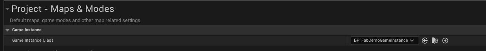

# Description

This is a plugin for Unreal Engine that integrates PlayFab services into your project. It provides functionality for authentication, character management using Economy V2, and cloud script execution example using azure function for Adding a character using AddInventoryItems. This is a client facing plugin for now. 

There will be another module added in the next few month more linked to dedicated server call.

 The goal is to create a layer of abstraction. This allows switching from PlayFab to another provider without significant changes. That's why the classes returned are not the one provided by playfab, and that's why we are using base class. 

## Missing but incoming

- Dedicated servers 
- Integrate more inventory endpoints

# ⚠️⚠️⚠️  IMPORTANT! ⚠️⚠️⚠️

This is a work in progress, naming aren't completed, and there is still few bugs and issues and is far from perfect. to keep in mind. I've released it because finding code to integrate playfab in ue5 was very difficult to find.

## Goal
I was trying to find example using the ue5 sdk, or using generative AI but both of those were often hard to find or not updated. 


## Features

- **Authentication**: Register, log in, and manage user accounts using PlayFab.
- **Character Management**: Create, retrieve, and manage characters using PlayFab's Economy and Inventory APIs.
- **Cloud Script Integration**: Execute custom cloud scripts for advanced server-side logic.
- **UI Widgets**: Prebuilt UI components for login, registration, and account management.


## Example
<video controls src="https://www.youtube.com/watch?v=GMJuzZAlCno" title="Demo" title="Title"></video>

## Project Structure

```
HelaPlayFabIntegration/
├── Source/
│   ├── HelaPlayFabIntegration/
│   │   ├── Public/
│   │   │   ├── Authentication/
│   │   │   ├── Character/
│   │   │   ├── Core/
│   │   │   └── [`Source/HelaPlayFabIntegration/Public/HelaPlayFabIntegration.h`](Source/HelaPlayFabIntegration/Public/HelaPlayFabIntegration.h )
│   │   ├── Private/ 
│   │   │   ├── Authentication/
│   │   │   ├── Character/
│   │   │   ├── Core/
│   │   │   └── [`Source/HelaPlayFabIntegration/Private/HelaPlayFabIntegration.cpp`](Source/HelaPlayFabIntegration/Private/HelaPlayFabIntegration.cpp )
├── Content/
│   ├── Demo/
│   │   ├── UI/
│   │   ├── Maps/
│   │   └── Game/
├── CloudScripts/
│   ├── Azurefunctions/
└── [`HelaPlayFabIntegration.uplugin`](HelaPlayFabIntegration.uplugin )
```


### Key Files

- **[HelaPlayFabIntegration.h](Source/HelaPlayFabIntegration/Public/HelaPlayFabIntegration.h)**: Main header file for the plugin.
- **[PlayFabManager](Source/HelaPlayFabIntegration/Public/Core/PlayFabManager.h)**: Core class for managing PlayFab API interactions.
- **[Authentication](Source/HelaPlayFabIntegration/Public/Authentication/)**: Handles user authentication and account management.
- **[Character Management](Source/HelaPlayFabIntegration/Public/Character/)**: Manages character creation, retrieval, and inventory.

## Setup

### Prerequisites

- Unreal Engine 4.27 or later.
- A PlayFab account and a configured PlayFab title.

### Installation

1. Clone this repository into your Unreal Engine project's `Plugins` folder:
   ```bash
   git clone https://github.com/your-repo/HelaPlayFabIntegration.git Plugins/HelaPlayFabIntegration
   ```
2. add the playfab plugin to your project ( in the .uplugin):

        {
            "Name": "PlayFab",
            "Enabled": true,
            "MarketplaceURL": "com.epicgames.launcher://ue/marketplace/content/217fdf581b784571af03d3fb6580368f"
        }

	
2. Open your Unreal Engine project. The plugin should be detected automatically.


4. Configure your PlayFab title ID in the `UPlayFabManager` class:
   ```cpp
   static const FString kTitleId = TEXT("YourPlayFabTitleId");
   ```

5. Make sure to setup your gameinstance in the project setting to be the one included in the demo, or copy paste the blueprint to make it in your actual game instance.


6. Build your project.

## Usage

### Authentication

Use the `UPlayFabLoginManager` class to handle user registration and login:
```cpp
UPlayFabLoginManager* LoginManager = NewObject<UPlayFabLoginManager>();
LoginManager->RegisterNewUser("email@example.com", "password123", "Username");
LoginManager->LoginExistingUser("email@example.com", "password123");
```

### Character Management

Use the `UPlayFabCharacterManager` class to manage characters:
```cpp
UPlayFabCharacterManager* CharacterManager = NewObject<UPlayFabCharacterManager>();
CharacterManager->CreateUserCharacter("CatalogItemId", "CharacterName", OnCharacterCreatedDelegate);
CharacterManager->GetUserCharacters(OnCharactersLoadedDelegate);
```

### Cloud Scripts

Execute custom cloud scripts using the `UPlayFabCloudScriptAPI`:
```cpp
PlayFab::CloudScriptModels::FExecuteFunctionRequest Request;
// Configure request...
CloudScriptAPI->ExecuteFunction(Request, OnSuccessDelegate, OnErrorDelegate);
```

## Cloud Scripts

The `CloudScripts` folder contains local and Azure Function implementations for server-side logic. For example:
- **[addInventoryItem.js](CloudScripts/local/addInventoryItem.js)**: Adds an inventory item to a user's account.
- **[AddCharacterFunction](CloudScripts/Azurefunctions/AddCharacterFunction/)**: Azure Function for adding characters.


## Demo Projects

My demo project use `DemoMenu` as a starting level. All the logics are in the HUD. There is also some setup done in the GameInstance. I would suggest to copy paste the GameInstance
### 🛠 Starting Point

**Starting Level:** `DemoMenu`  
Launches the full login ➔ character management ➔ main menu flow.

---

 ### 🎮 Flow Overview

### Main Menu (`BPW_DemoMainMenu`)
- **Continue:** Load the last selected character (only visible if characters exist).
- **New Game:** Create a new character.
- **Options:** *(Not implemented yet)*.
- **Quit:** Exit the game.

### New Game Flow
**Character Select (`BPW_CharacterSelect`)**
- View your available characters.
- Select an existing character or create a new one.

### Character Creation Flow
**Character Create (`BPW_CharacterCreate`)**
- Choose an avatar.
- Enter a character name.
- Review character descriptions.

### After Selection
- After picking or creating a character, you transition to gameplay (or demo lobby).


## Contributing

Contributions are welcome! Please fork the repository and submit a pull request.

## License

This project is licensed under the MIT License. See the `LICENSE` file for details.

## Support

For support, contact [HelaStudio](https://helastudio.com) or visit the [PlayFab documentation](https://learn.microsoft.com/en-us/gaming/playfab/).
